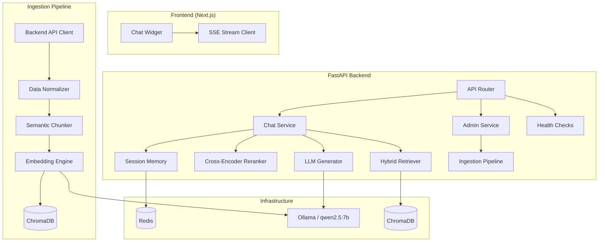

# Production-Ready RAG Chatbot System — Implementation Plan

## Overview

Build a modular, production-ready AI chatbot that ingests knowledge from **backend APIs** (no scraping), stores embeddings in **ChromaDB**, and generates answers via **Ollama (qwen2.5:7b)** with full RAG pipeline. The system uses **async FastAPI**, **Redis** session memory, **SSE streaming**, and a **Next.js + Tailwind + shadcn/ui** frontend — all orchestrated with **Docker Compose**.

This plan follows modern 2026 RAG practices:

- **Semantic search over lexical-only search** using transformer embeddings.
- **ANN / HNSW vector indexing** for low-latency approximate nearest-neighbor search.
- **Hybrid retrieval** to combine dense semantic search with keyword matching.
- **QR-RAG query reformulation** for better retrieval on complex questions.
- **Precomputed embeddings** outside ChromaDB to avoid ingestion bottlenecks.
- **Async SSE token streaming** from FastAPI using Ollama's async streaming client.
- **Clean layer separation** between embedding compute, Chroma storage, and generation orchestration.

---

## Research-Informed Architecture Principles

### 1. Modern Semantic Search Approach

Traditional keyword-only retrieval depends on exact lexical overlap and can fail when users and documents use different terminology. This is the classic **vocabulary mismatch problem**. The chatbot should therefore use semantic retrieval as the primary retrieval mechanism.

Modern semantic search works by converting documents and queries into dense vector embeddings produced by transformer-based encoders. These embeddings capture contextual meaning rather than only surface tokens.

Recommended embedding approach:

- Serialize backend API objects into clean text documents.
- Generate embeddings using a dedicated embedding model such as `nomic-embed-text`.
- Store vectors plus rich metadata in ChromaDB.
- Embed user queries at request time.
- Retrieve nearest neighbors using ChromaDB's vector search.

### 2. ANN and HNSW Indexing

At production scale, brute-force vector comparison is too slow. The vector database should use **Approximate Nearest Neighbor (ANN)** search, specifically an **HNSW (Hierarchical Navigable Small World)** index when supported/configured by the vector store.

HNSW is preferred because it provides a strong balance between:

- High recall.
- Low latency.
- Good performance for medium-to-large vector collections.
- Practical memory/query-time tradeoffs.

The plan should avoid flat vector scans for production workloads.

### 3. QR-RAG Query Reformulation

Simple semantic similarity can underperform for complex, technical, multi-part, or ambiguous user questions. To improve recall, the retrieval pipeline should include optional **Query Reformulation RAG (QR-RAG)**.

QR-RAG flow:

```text
User question → Query analyzer → LLM query rewrite / expansion → Hybrid retrieval → Reranking → Generation
```

Examples:

- Expand acronyms and domain-specific terms.
- Convert vague questions into explicit retrieval queries.
- Generate multiple sub-queries for multi-intent questions.
- Preserve the original user question for final answer generation.

### 4. ChromaDB Production Best Practices

ChromaDB is developer-friendly and well-suited for local and medium-scale RAG deployments, but production use requires discipline:

- Precompute embeddings before upsert; do not rely on Chroma embedding wrappers.
- Use HNSW/ANN indexing instead of flat scans.
- Monitor memory usage, query latency, and collection growth.
- Batch upserts during ingestion.
- Keep metadata schemas stable and filter-friendly.
- Use deterministic chunk IDs for idempotent incremental sync.
- Run ChromaDB as a dedicated Docker service with persistent volumes.
- Consider Qdrant or Milvus later if high-availability clustering, extreme concurrency, or advanced index tuning becomes mandatory.

### 5. FastAPI + Ollama + SSE Pattern

LLM generation can take several seconds. Returning only after the full response is complete creates poor UX and can cause HTTP timeouts. The production pattern is:

```text
FastAPI endpoint → async generator → Ollama stream=True → SSE events → frontend streaming UI
```

FastAPI should return `StreamingResponse` using an async generator. Ollama should be called with async streaming enabled so tokens are yielded incrementally.

SSE event format:

```text
data: {"type":"token","content":"partial token"}\n\n
data: {"type":"sources","sources":[...]}\n\n
data: {"type":"done"}\n\n
```

### 6. Clean Separation of Concerns

The system should strictly separate:

| Layer                       | Responsibility                                       |
| --------------------------- | ---------------------------------------------------- |
| Backend API ingestion layer | Fetch authoritative knowledge from backend APIs only |
| Normalization layer         | Convert API responses into canonical documents       |
| Chunking layer              | Produce semantic, metadata-rich chunks               |
| Embedding compute layer     | Generate vectors asynchronously before storage       |
| ChromaDB storage layer      | Store vectors, metadata, and documents               |
| Retrieval layer             | Hybrid search, query reformulation, filtering        |
| Reranking layer             | Cross-encoder relevance scoring                      |
| Generation layer            | Prompt construction and Ollama streaming             |
| Guardrail layer             | Hallucination prevention and citation validation     |
| Memory layer                | Redis-backed session continuity                      |

---

## Architecture Diagram



---

## Data Flow

### Ingestion Flow

```
Backend APIs → API Client (async httpx) → Normalize → Semantic Chunk (with metadata) → Embed (Ollama) → Upsert ChromaDB
```

### Generation Flow

```
User Question → Session Memory → Query Reformulation (QR-RAG) → Hybrid Retrieval (dense + keyword) → Rerank (cross-encoder) → Prompt Build (with citations) → Qwen2.5 Generation → Hallucination Check → SSE Stream Response
```

### Async SSE Streaming Flow

```
FastAPI /chat/stream → Retrieve context from ChromaDB → Build grounded prompt → Ollama AsyncClient stream=True → Yield SSE token events → Frontend renders tokens live
```

---

## Project Structure

```
entrance-chatbot/
├── docker-compose.yml
├── docker-compose.prod.yml
├── .env.example
├── Makefile
│
├── backend/
│   ├── Dockerfile
│   ├── requirements.txt
│   ├── pyproject.toml
│   ├── main.py                          # FastAPI app entry
│   ├── config.py                        # Pydantic Settings (env-based)
│   │
│   ├── api/
│   │   ├── __init__.py
│   │   ├── router.py                    # Top-level router aggregator
│   │   ├── chat.py                      # POST /chat, GET /chat/stream
│   │   ├── admin.py                     # POST /admin/refresh, /admin/sync
│   │   ├── health.py                    # GET /health, /health/ready
│   │   └── webhooks.py                  # POST /webhooks/content-update
│   │
│   ├── core/
│   │   ├── __init__.py
│   │   ├── logging.py                   # Structured JSON logging
│   │   ├── middleware.py                # Rate limiting, CORS, security
│   │   ├── exceptions.py               # Custom exception handlers
│   │   └── retry.py                     # Retry/timeout decorators
│   │
│   ├── ingestion/
│   │   ├── __init__.py
│   │   ├── api_client.py               # Async backend API fetcher
│   │   ├── normalizer.py               # Raw data → normalized docs
│   │   ├── chunker.py                  # Semantic chunking + metadata
│   │   ├── embedder.py                 # Ollama embedding generation
│   │   └── pipeline.py                 # Orchestrates full ingestion
│   │
│   ├── retrieval/
│   │   ├── __init__.py
│   │   ├── vector_store.py             # ChromaDB client wrapper
│   │   ├── query_rewriter.py           # QR-RAG query rewriting/expansion
│   │   ├── hybrid.py                   # Dense + keyword hybrid search
│   │   ├── reranker.py                 # Cross-encoder reranking
│   │   └── retriever.py               # Unified retrieval interface
│   │
│   ├── generation/
│   │   ├── __init__.py
│   │   ├── llm_client.py              # Ollama async client
│   │   ├── prompt_builder.py          # Prompt templates + engineering
│   │   ├── hallucination.py           # Hallucination prevention/checks
│   │   ├── citation.py                # Source citation formatter
│   │   └── generator.py              # Orchestrates generation pipeline
│   │
│   ├── memory/
│   │   ├── __init__.py
│   │   └── session.py                 # Redis-backed conversation memory
│   │
│   ├── models/
│   │   ├── __init__.py
│   │   ├── schemas.py                 # Pydantic request/response models
│   │   └── domain.py                  # Internal domain models
│   │
│   └── tests/
│       ├── conftest.py                # Shared fixtures
│       ├── test_ingestion.py
│       ├── test_retrieval.py
│       ├── test_generation.py
│       └── test_api.py
│
├── frontend/
│   ├── Dockerfile
│   ├── package.json
│   ├── next.config.ts
│   ├── tailwind.config.ts
│   ├── tsconfig.json
│   ├── components.json                # shadcn/ui config
│   │
│   ├── src/
│   │   ├── app/
│   │   │   ├── layout.tsx
│   │   │   ├── page.tsx
│   │   │   └── globals.css
│   │   │
│   │   ├── components/
│   │   │   ├── chat/
│   │   │   │   ├── ChatWidget.tsx     # Main chat container
│   │   │   │   ├── MessageList.tsx    # Message display with citations
│   │   │   │   ├── MessageBubble.tsx  # Individual message rendering
│   │   │   │   ├── InputBar.tsx       # Input with send button
│   │   │   │   ├── TypingIndicator.tsx
│   │   │   │   └── SourceCard.tsx     # Citation source display
│   │   │   └── ui/                    # shadcn/ui components
│   │   │
│   │   ├── hooks/
│   │   │   ├── useChat.ts            # Chat state + SSE streaming
│   │   │   └── useAutoScroll.ts
│   │   │
│   │   ├── lib/
│   │   │   ├── api.ts                # Backend API client
│   │   │   └── utils.ts
│   │   │
│   │   └── types/
│   │       └── chat.ts               # TypeScript types
│   │
│   └── public/
│
└── docs/
    └── api.md                         # API documentation
```

---

## Proposed Changes — Phase by Phase

### Phase 1: Infrastructure & Configuration

#### [NEW] docker-compose.yml

Docker Compose orchestrating 5 services:

- **backend** — FastAPI app (port 8000)
- **frontend** — Next.js app (port 3000)
- **chromadb** — ChromaDB server (port 8001)
- **redis** — Redis 7 (port 6379)
- **ollama** — Ollama with qwen2.5:7b (port 11434)

Volumes for ChromaDB persistence and Ollama model storage. Health checks on all services. Shared `chatbot-network` bridge network.

#### [NEW] .env.example

```env
# Backend API sources
BACKEND_API_BASE_URL=http://your-backend:8000/api
BACKEND_API_KEY=your-api-key

# Ollama
OLLAMA_BASE_URL=http://ollama:11434
OLLAMA_MODEL=qwen2.5:7b
OLLAMA_EMBED_MODEL=nomic-embed-text

# ChromaDB
CHROMA_HOST=chromadb
CHROMA_PORT=8001
CHROMA_COLLECTION=entrance_knowledge

# Redis
REDIS_URL=redis://redis:6379/0
SESSION_TTL_SECONDS=3600

# Security
API_KEY=your-admin-api-key
CORS_ORIGINS=http://localhost:3000
RATE_LIMIT_REQUESTS=30
RATE_LIMIT_WINDOW=60

# App
LOG_LEVEL=INFO
ENVIRONMENT=development
```

#### [NEW] backend/config.py

Pydantic `BaseSettings` with `.env` loading, validation, and environment-specific defaults. Groups: `OllamaSettings`, `ChromaSettings`, `RedisSettings`, `SecuritySettings`, `IngestionSettings`.

#### [NEW] Makefile

Targets: `up`, `down`, `build`, `logs`, `test`, `lint`, `seed`, `refresh`.

---

### Phase 2: Core Backend Framework

#### [NEW] backend/main.py

Async FastAPI application with:

- Lifespan handler for startup/shutdown (init ChromaDB, Redis, Ollama health check)
- Middleware registration (CORS, rate limiting, request logging)
- Router inclusion
- Global exception handlers

#### [NEW] backend/core/logging.py

Structured JSON logging via `structlog`:

- Request ID correlation
- Performance timing
- Component-tagged log entries (ingestion, retrieval, generation)

#### [NEW] backend/core/middleware.py

- **Rate Limiting**: Token-bucket via Redis (`slowapi` or custom)
- **CORS**: Configurable origins from env
- **Security**: API key validation for admin endpoints
- **Request Logging**: Log method, path, status, duration

#### [NEW] backend/core/retry.py

- `@with_retry` decorator: exponential backoff, configurable max retries
- `@with_timeout` decorator: asyncio timeout wrapper
- Both composable and used throughout ingestion + generation

#### [NEW] backend/core/exceptions.py

Custom exceptions: `LLMUnavailableError`, `RetrievalError`, `IngestionError`, `RateLimitExceeded`. Mapped to HTTP responses via FastAPI exception handlers.

---

### Phase 3: Ingestion Pipeline

> **Key Design**: No web scraping. All data comes from backend REST APIs.

#### [NEW] backend/ingestion/api_client.py

```python
class BackendAPIClient:
    """Async httpx client to fetch data from backend APIs."""

    async def fetch_programs(self) -> list[RawDocument]
    async def fetch_courses(self) -> list[RawDocument]
    async def fetch_scholarships(self) -> list[RawDocument]
    async def fetch_faqs(self) -> list[RawDocument]
    async def fetch_all(self) -> list[RawDocument]
    async def fetch_updated_since(self, since: datetime) -> list[RawDocument]
```

- Uses `httpx.AsyncClient` with connection pooling
- Retry logic via `@with_retry` decorator
- Pagination support for large datasets
- Returns normalized `RawDocument` objects

#### [NEW] backend/ingestion/normalizer.py

```python
class DataNormalizer:
    """Transforms raw API responses into uniform Document format."""

    def normalize(self, raw: RawDocument) -> NormalizedDocument
```

- Maps heterogeneous API schemas → unified `NormalizedDocument`
- Extracts and preserves metadata (source_type, source_id, title, updated_at, category, tags)
- Handles missing fields gracefully

#### [NEW] backend/ingestion/chunker.py

**Semantic chunking** — NOT fixed-size splitting:

```python
class SemanticChunker:
    """Splits documents by semantic boundaries with rich metadata."""

    def chunk(self, doc: NormalizedDocument) -> list[Chunk]
```

- Uses sentence-boundary detection + cosine similarity between sentence embeddings
- Groups semantically similar sentences into chunks
- Each `Chunk` carries metadata: `source_id`, `source_type`, `title`, `section`, `chunk_index`, `total_chunks`, `created_at`, `tags`
- Target chunk size: 256-512 tokens with overlap
- Falls back to recursive character splitting if semantic chunking fails

#### [NEW] backend/ingestion/embedder.py

```python
class EmbeddingEngine:
    """Generates embeddings via Ollama."""

    async def embed_texts(self, texts: list[str]) -> list[list[float]]
    async def embed_query(self, query: str) -> list[float]
```

- Uses `nomic-embed-text` model via Ollama API
- Batched embedding (configurable batch size)
- Retry + timeout on Ollama calls

#### [NEW] backend/ingestion/pipeline.py

```python
class IngestionPipeline:
    """Orchestrates: fetch → normalize → chunk → embed → store."""

    async def run_full_sync(self) -> IngestionReport
    async def run_incremental_sync(self, since: datetime) -> IngestionReport
    async def refresh_collection(self, source_type: str) -> IngestionReport
```

- Coordinates all ingestion components
- Returns `IngestionReport` with stats (docs processed, chunks created, errors)
- Incremental sync: only re-embeds documents updated since last sync
- Stores sync watermark in Redis

---

### Phase 4: Retrieval & Reranking

#### [NEW] backend/retrieval/vector_store.py

```python
class ChromaVectorStore:
    """ChromaDB async wrapper with collection management."""

    async def upsert(self, chunks: list[Chunk], embeddings: list[list[float]])
    async def query_dense(self, embedding: list[float], top_k: int, filters: dict) -> list[RetrievedChunk]
    async def query_keyword(self, text: str, top_k: int, filters: dict) -> list[RetrievedChunk]
    async def delete_by_source(self, source_id: str)
    async def get_collection_stats(self) -> dict
```

- Uses `chromadb.HttpClient` through an async-safe wrapper
- Metadata filtering support
- Collection creation with cosine distance
- Production configuration should use ANN/HNSW indexing, not flat scans
- Embeddings are precomputed by the embedding layer before upsert
- Batch upserts are used to reduce ingestion overhead
- Deterministic IDs allow idempotent incremental sync and safe re-ingestion
- Collection metrics should track document count, vector count, latency, and memory growth

#### [NEW] backend/retrieval/query_rewriter.py

```python
class QueryRewriter:
    """Optional QR-RAG component that rewrites or expands user queries."""

    async def rewrite(self, question: str, history: list[Message]) -> list[str]
```

- Uses Ollama/qwen2.5 with a low-temperature prompt to reformulate queries
- Produces one primary rewritten query plus optional sub-queries
- Preserves the original user question for final answer generation
- Improves retrieval for vague, multi-step, or terminology-mismatched questions
- Falls back to the original question if rewriting fails or times out

#### [NEW] backend/retrieval/hybrid.py

**Hybrid retrieval** combining dense vector + keyword search:

```python
class HybridRetriever:
    """Combines dense and keyword retrieval with RRF fusion."""

    async def retrieve(self, query: str, top_k: int = 20, filters: dict = None) -> list[RetrievedChunk]
```

- Dense: embed query → ChromaDB vector similarity
- Keyword: ChromaDB `where_document` full-text matching
- Fusion via **Reciprocal Rank Fusion (RRF)**: `score = Σ 1/(k + rank_i)`
- Deduplication by chunk ID
- Returns merged, scored results

#### [NEW] backend/retrieval/reranker.py

```python
class CrossEncoderReranker:
    """Reranks retrieved chunks using cross-encoder scoring."""

    async def rerank(self, query: str, chunks: list[RetrievedChunk], top_k: int = 5) -> list[RetrievedChunk]
```

- Uses `sentence-transformers` `CrossEncoder` model (`cross-encoder/ms-marco-MiniLM-L-6-v2`)
- Runs in thread pool to avoid blocking async loop
- Assigns relevance scores, returns top-k

Unified interface: `retrieve(query) → optional QR-RAG rewrite → hybrid search → rerank → top results`.

Recommended retrieval algorithm:

1. Accept original user question and recent session history.
2. Generate rewritten/expanded queries with `QueryRewriter` when enabled.
3. Embed each retrieval query using the embedding engine.
4. Perform dense vector search in ChromaDB.
5. Perform keyword/full-text search for lexical precision.
6. Fuse results with Reciprocal Rank Fusion.
7. Deduplicate by stable chunk ID.
8. Rerank top candidates with cross-encoder.
9. Return top grounded chunks for prompt construction.

---

### Phase 5: Generation Pipeline

#### [NEW] backend/generation/llm_client.py

```python
class OllamaClient:
    """Async Ollama client with streaming support."""

    async def generate(self, prompt: str, system: str) -> str
    async def generate_stream(self, prompt: str, system: str) -> AsyncGenerator[str, None]
```

- Uses Ollama async streaming (`AsyncClient` or `httpx.AsyncClient`) with `stream=True`
- Streams from Ollama `/api/generate` or equivalent async Ollama client API
- Configurable temperature, top_p, max tokens
- Timeout + retry with graceful fallback messages
- Yields tokens as soon as they are available to avoid HTTP timeout and improve UX
- Supports cancellation handling if the client disconnects

#### [NEW] backend/generation/prompt_builder.py

```python
class PromptBuilder:
    """Constructs prompts with context, history, and citation instructions."""

    def build_system_prompt(self) -> str
    def build_user_prompt(self, question: str, context: list[RetrievedChunk], history: list[Message]) -> str
```

**Prompt engineering best practices applied:**

- System prompt enforces: answer ONLY from provided context, cite sources as `[Source N]`, say "I don't have enough information" when context is insufficient
- Context formatted as numbered sources with metadata
- Conversation history included (last N turns)
- Anti-hallucination instructions embedded in system prompt

**System prompt template:**

```
You are a helpful assistant for Entrance Gateway. Answer questions ONLY using the
provided context. Follow these rules strictly:

1. Use ONLY the information from the provided sources
2. Cite sources using [Source N] format inline
3. If the context doesn't contain enough information, say:
   "I don't have enough information to answer that accurately."
4. Never make up information, URLs, dates, or statistics
5. Be concise and helpful
```

#### [NEW] backend/generation/hallucination.py

```python
class HallucinationGuard:
    """Post-generation checks to prevent hallucinated content."""

    def check(self, response: str, context: list[RetrievedChunk]) -> GuardResult
```

- **Grounding check**: Verify key claims in response exist in source chunks (fuzzy matching)
- **Citation validation**: Ensure cited source numbers are valid
- **Confidence scoring**: Rate response confidence based on context overlap
- **Fallback**: If confidence < threshold, append disclaimer or replace with safe response

#### [NEW] backend/generation/citation.py

Formats `[Source N]` references and generates a source list appended to each response:

```
Sources:
[1] Program: Computer Science — programs/cs-101
[2] FAQ: Admission Requirements — faqs/admission-req
```

#### [NEW] backend/generation/generator.py

Orchestrates: `prompt build → LLM generate (stream) → hallucination check → citation format → yield SSE chunks`.

---

### Phase 6: Session Memory

#### [NEW] backend/memory/session.py

```python
class RedisSessionMemory:
    """Redis-backed conversation memory with TTL."""

    async def get_history(self, session_id: str, max_turns: int = 10) -> list[Message]
    async def add_message(self, session_id: str, message: Message)
    async def clear_session(self, session_id: str)
```

- Stores messages as JSON in Redis lists
- Configurable TTL (default 1 hour)
- Automatic trimming to max turns
- Session ID from client (UUID)

---

### Phase 7: API Endpoints

#### [NEW] backend/api/chat.py

```python
@router.post("/chat")
async def chat(request: ChatRequest) -> ChatResponse:
    """Non-streaming chat endpoint."""

@router.post("/chat/stream")
async def chat_stream(request: ChatRequest) -> StreamingResponse:
    """SSE streaming chat endpoint."""
```

- SSE format: `data: {"type": "token", "content": "..."}\n\n`
- Event types: `token`, `sources`, `done`, `error`, `heartbeat`
- Session ID in request for memory continuity
- Implemented with FastAPI `StreamingResponse` and an async generator
- Retrieval and prompt construction happen before token streaming starts
- Ollama token chunks are flushed to the frontend immediately
- Heartbeat events keep long-lived connections from being closed by proxies

#### [NEW] backend/api/admin.py

```python
@router.post("/admin/refresh")      # Full re-ingestion
@router.post("/admin/sync")         # Incremental sync
@router.get("/admin/stats")         # Collection statistics
@router.delete("/admin/collection") # Clear and rebuild
```

- Protected by API key middleware
- Returns `IngestionReport` with detailed stats

#### [NEW] backend/api/health.py

```python
@router.get("/health")       # Liveness: app is running
@router.get("/health/ready") # Readiness: all dependencies connected
```

- Readiness checks: ChromaDB, Redis, Ollama connectivity
- Returns component-level status

#### [NEW] backend/api/webhooks.py

```python
@router.post("/webhooks/content-update")
async def handle_content_update(payload: WebhookPayload):
    """Triggered by backend when content changes."""
```

- Validates webhook signature
- Triggers targeted re-ingestion for changed content
- Async background task via `BackgroundTasks`

---

### Phase 8: Models & Schemas

#### [NEW] backend/models/schemas.py

Pydantic models for API I/O:

- `ChatRequest(session_id, message, filters?)`
- `ChatResponse(message, sources, session_id, confidence)`
- `StreamChunk(type, content, sources?)`
- `IngestionReport(total_docs, total_chunks, errors, duration_seconds)`
- `HealthResponse(status, components)`
- `WebhookPayload(event_type, source_type, source_ids, timestamp)`

#### [NEW] backend/models/domain.py

Internal models:

- `RawDocument`, `NormalizedDocument`, `Chunk`, `RetrievedChunk`
- `Message(role, content, timestamp, sources?)`
- `GuardResult(is_safe, confidence, flags)`

---

### Phase 9: Frontend (Next.js + Tailwind + shadcn/ui)

#### [NEW] frontend/ (Next.js project)

Initialize with: `npx -y create-next-app@latest ./ --typescript --tailwind --eslint --app --src-dir --no-import-alias`
Then add shadcn/ui: `npx -y shadcn@latest init`

#### [NEW] frontend/src/hooks/useChat.ts

Core chat hook:

- Manages message state, loading, error
- Opens `EventSource` for SSE streaming
- Accumulates tokens into message bubble in real-time
- Handles `sources` event to display citations
- Auto-generates session UUID, persists in localStorage

#### [NEW] frontend/src/components/chat/ChatWidget.tsx

Full-featured chat widget:

- Collapsible floating button (bottom-right)
- Slide-up animation on open
- Header with title + close button
- MessageList + InputBar + TypingIndicator
- Dark/light mode support

#### [NEW] frontend/src/components/chat/MessageBubble.tsx

- User vs assistant styling
- Markdown rendering for assistant messages
- Inline `[Source N]` rendered as clickable badges
- Streaming token animation (fade-in per token)

#### [NEW] frontend/src/components/chat/TypingIndicator.tsx

Animated three-dot bounce indicator shown during streaming.

#### [NEW] frontend/src/components/chat/SourceCard.tsx

Expandable source citation card showing: title, type, snippet, link.

---

### Phase 10: Docker & Deployment

#### [NEW] backend/Dockerfile

```dockerfile
FROM python:3.12-slim
# Multi-stage optional for production
WORKDIR /app
COPY requirements.txt .
RUN pip install --no-cache-dir -r requirements.txt
COPY . .
CMD ["uvicorn", "main:app", "--host", "0.0.0.0", "--port", "8000"]
```

#### [NEW] frontend/Dockerfile

```dockerfile
FROM node:20-alpine AS builder
WORKDIR /app
COPY package*.json ./
RUN npm ci
COPY . .
RUN npm run build

FROM node:20-alpine AS runner
WORKDIR /app
COPY --from=builder /app/.next/standalone ./
COPY --from=builder /app/.next/static ./.next/static
COPY --from=builder /app/public ./public
CMD ["node", "server.js"]
```

#### [NEW] docker-compose.prod.yml

Production overrides: resource limits, restart policies, log drivers, no port exposure for internal services.

---

### Phase 11: Testing

#### [NEW] backend/tests/conftest.py

Shared fixtures: mock Ollama client, in-memory ChromaDB, fake Redis, test FastAPI client.

#### [NEW] backend/tests/test_ingestion.py

- Test normalizer with various API response formats
- Test semantic chunker output shape and metadata
- Test embedder batching
- Test full pipeline with mocked API client
- Test incremental sync logic

#### [NEW] backend/tests/test_retrieval.py

- Test vector store upsert + query
- Test hybrid retrieval fusion (RRF scoring)
- Test reranker ordering
- Test metadata filtering

#### [NEW] backend/tests/test_generation.py

- Test prompt builder output format
- Test hallucination guard (safe vs unsafe responses)
- Test citation extraction and formatting
- Test streaming generator yields correct SSE format

#### [NEW] backend/tests/test_api.py

- Test chat endpoint (non-streaming)
- Test SSE streaming endpoint
- Test admin endpoints (auth required)
- Test health check endpoints
- Test webhook endpoint
- Test rate limiting

---

### Phase 12: Observability & Monitoring

#### Structured Logging (in backend/core/logging.py)

- JSON logs with: timestamp, level, component, request_id, duration_ms, metadata
- Log ingestion stats, retrieval latency, LLM token counts, error rates

#### Monitoring Hooks

- `/metrics` endpoint exposing: request count, latency histograms, ingestion stats, LLM response times
- Compatible with Prometheus scraping (optional integration)
- Health check endpoints for container orchestration

#### Graceful Fallbacks

- Ollama unavailable → return cached response or "Service temporarily unavailable" with retry suggestion
- ChromaDB unavailable → log error, return graceful error message
- Redis unavailable → fall back to in-memory session (degraded mode)
- Timeout on any component → return partial response if available

---

## Key Technical Decisions

| Decision                 | Choice                                            | Rationale                                                        |
| ------------------------ | ------------------------------------------------- | ---------------------------------------------------------------- |
| Embedding model          | `nomic-embed-text` via Ollama                     | Dedicated local embedding model with strong semantic quality     |
| Vector indexing          | ChromaDB ANN/HNSW                                 | Avoids flat scans and supports low-latency vector retrieval      |
| Query reformulation      | QR-RAG with qwen2.5                               | Improves retrieval for vague, technical, or multi-part questions |
| Reranker                 | `cross-encoder/ms-marco-MiniLM-L-6-v2`            | Small, fast, proven accuracy for reranking                       |
| Chunking                 | Semantic (sentence-boundary + similarity)         | Better coherence than fixed-size splitting                       |
| Retrieval fusion         | Reciprocal Rank Fusion                            | Simple, effective, no hyperparameter tuning                      |
| Session storage          | Redis with TTL                                    | Fast, scalable, auto-expiring sessions                           |
| SSE format               | `data: {json}\n\n`                                | Standard SSE, easy to parse in frontend                          |
| Streaming engine         | FastAPI `StreamingResponse` + Ollama async stream | Prevents timeout and improves perceived responsiveness           |
| Hallucination prevention | Grounding check + confidence scoring              | Multi-layer defense without extra LLM calls                      |
| Chroma scale path        | Evaluate Qdrant/Milvus if needed                  | Future option for HA clustering or extreme concurrency           |

---

## Open Questions

> [!IMPORTANT]
> **Backend API Structure**: What are the actual backend API endpoints to ingest from? I'll need the base URL pattern and response schemas (or I can design a flexible adapter that you configure later).

> [!IMPORTANT]
> **Content Types**: What types of content will be ingested? (e.g., programs, courses, scholarships, FAQs, blog posts). This affects the normalizer and metadata schema.

> [!IMPORTANT]
> **Authentication**: Do the backend APIs require authentication? If so, what type (API key, OAuth, JWT)?

> [!NOTE]
> **Embedding Model**: I'm planning to use `nomic-embed-text` for embeddings (via Ollama, runs locally). Alternatively, we could use Ollama's built-in embedding with `qwen2.5:7b` itself, but a dedicated embedding model is recommended. Confirm this is acceptable.

> [!NOTE]
> **Frontend Deployment**: Should the chat widget be a standalone page or an embeddable widget (iframe/web component) for integration into an existing site?

---

## Verification Plan

### Automated Tests

```bash
# Run all backend tests
docker compose exec backend pytest tests/ -v --cov=. --cov-report=term

# Run specific test suites
docker compose exec backend pytest tests/test_ingestion.py -v
docker compose exec backend pytest tests/test_retrieval.py -v
docker compose exec backend pytest tests/test_generation.py -v
docker compose exec backend pytest tests/test_api.py -v
```

### Integration Verification

1. `docker compose up` — all 5 services start and pass health checks
2. Trigger ingestion via `POST /admin/refresh` — verify chunks in ChromaDB
3. Send chat message — verify retrieval → reranking → generation pipeline
4. Verify SSE streaming in browser dev tools
5. Verify frontend renders streaming tokens + citations
6. Test rate limiting by exceeding threshold
7. Test webhook trigger for incremental sync

### Manual Verification

- Open frontend at `localhost:3000`, send questions, verify streaming + citations
- Check structured logs in `docker compose logs backend`
- Verify graceful fallback by stopping Ollama container mid-chat

---

## Detailed Implementation Phases

The full step-by-step implementation phase roadmap is maintained in a separate file:

[RAG_CHATBOT_IMPLEMENTATION_PHASES.md](file:///home/rohan-shrestha/Desktop/entrance-gateway/entrance-chatbot/RAG_CHATBOT_IMPLEMENTATION_PHASES.md)


| Phase | Component                                   | Estimated Files | Dependencies |
| ----- | ------------------------------------------- | --------------- | ------------ |
| 1     | Infrastructure (Docker, config, env)        | 5               | None         |
| 2     | Core framework (logging, middleware, retry) | 5               | Phase 1      |
| 3     | Ingestion pipeline                          | 6               | Phase 2      |
| 4     | Retrieval & reranking                       | 5               | Phase 3      |
| 5     | Generation pipeline                         | 6               | Phase 4      |
| 6     | Session memory                              | 2               | Phase 2      |
| 7     | API endpoints                               | 5               | Phases 3-6   |
| 8     | Models & schemas                            | 3               | Phase 2      |
| 9     | Frontend                                    | ~15             | Phase 7      |
| 10    | Docker production                           | 3               | Phase 9      |
| 11    | Tests                                       | 5               | Phases 3-7   |
| 12    | Observability                               | 2               | Phase 2      |

**Total: ~62 files across backend + frontend**
