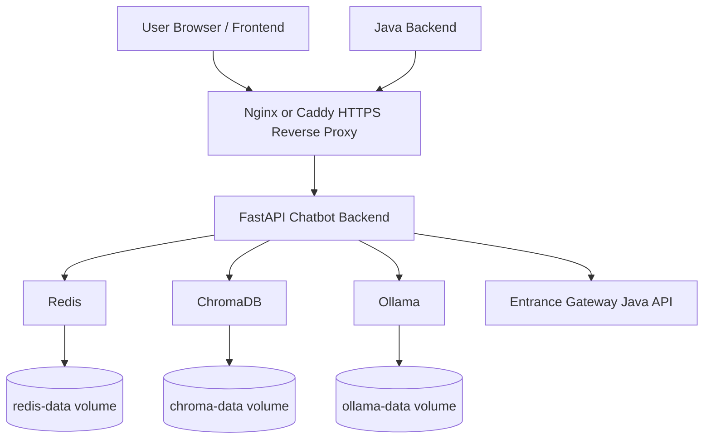
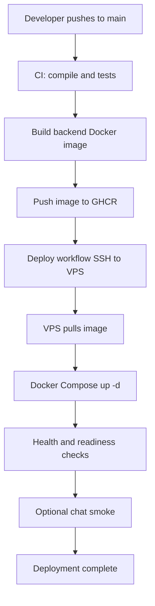

# Production CI/CD Pipeline Plan for VPS Deployment

This document describes a production-ready CI/CD plan to deploy the Entrance Gateway RAG chatbot backend on a VPS using Docker Compose, GitHub Actions, SSH-based deployment, reverse proxy TLS, health checks, backups, rollback, and post-deploy validation.

---

## 1. Goal

Deploy the chatbot stack safely and repeatably to a VPS.

Production stack:

```text
FastAPI chatbot backend
Redis session/rate-limit store
ChromaDB vector database
Ollama local LLM runtime
Docker Compose orchestration
Nginx/Caddy reverse proxy with HTTPS
GitHub Actions CI/CD
```

The pipeline should:

```text
run tests before deployment
build backend image
copy or pull release to VPS
restart services safely
verify health/readiness
optionally run ingestion refresh
support rollback
avoid exposing secrets
preserve ChromaDB/Ollama/Redis volumes
```

---

## 2. Recommended VPS Requirements

Minimum practical VPS for current stack:

| Resource | Minimum | Recommended |
| :--- | :--- | :--- |
| CPU | 2 vCPU | 4 vCPU |
| RAM | 8 GB | 12-16 GB |
| Disk | 50 GB SSD | 80-160 GB SSD |
| OS | Ubuntu 22.04 LTS | Ubuntu 22.04/24.04 LTS |
| Swap | 4 GB | 8 GB |

Why:

```text
Ollama + embeddings + ChromaDB need memory.
qwen2.5:3b is lighter than 7b but still benefits from 8GB+ RAM.
```

---

## 3. Production Architecture



Current VPS public port usage from `docker ps`:

| Host Port | Current Container | Status for Chatbot |
| :--- | :--- | :--- |
| `3000` | Grafana | Do not use |
| `3100` | Loki | Do not use |
| `5000` | Entrance Gateway frontend | Do not use |
| `6030` | CMS frontend | Do not use |
| `8080` | Java backend | Do not use |
| `9000` | Portainer | Do not use |
| `9001` | Portainer agent | Do not use |
| `9090` | Prometheus | Do not use |
| `9443` | Portainer HTTPS | Do not use |

Recommended chatbot host port plan:

```text
127.0.0.1:8002 -> chatbot backend only
```

Do **not** publish these chatbot dependency ports to the host in production:

```text
ChromaDB: Docker network only, no host port
Redis: Docker network only, no host port
Ollama: Docker network only, no host port
```

Why:

```text
The chatbot backend can reach Redis, ChromaDB, and Ollama by Docker service name.
The public internet does not need direct access to those services.
This avoids collisions with existing VPS services and improves security.
```

Public traffic should be:

```text
Frontend / Java backend / admin user
→ Nginx/Caddy on 80/443
→ 127.0.0.1:8002
→ chatbot backend container
```

Internal chatbot service ports:

```text
backend container: 8000
chromadb container: 8000, Docker network only
redis container: 6379, Docker network only
ollama container: 11434, Docker network only
```

---

## 4. Repository Preparation

Current compose file is development-friendly because backend mounts source code:

```yaml
volumes:
  - ./backend:/app
```

For production, create a separate file:

```text
docker-compose.prod.yml
```

Recommended production behavior:

```text
no source-code bind mount
use built image or local build
persistent named volumes for chroma/redis/ollama
backend exposed only to reverse proxy or localhost
```

---

## 5. Proposed Production Compose File

Create:

```text
docker-compose.prod.yml
```

Example:

```yaml
services:
  backend:
    image: ghcr.io/YOUR_ORG/entrance-chatbot-backend:${APP_VERSION:-latest}
    container_name: entrance-chatbot-backend
    env_file:
      - .env.production
    ports:
      - "127.0.0.1:8002:8000"
    depends_on:
      redis:
        condition: service_healthy
      chromadb:
        condition: service_started
      ollama:
        condition: service_started
    networks:
      - chatbot-network
    restart: unless-stopped
    command: uvicorn main:app --host 0.0.0.0 --port 8000 --workers ${UVICORN_WORKERS:-1}

  chromadb:
    image: chromadb/chroma:0.5.23
    container_name: entrance-chatbot-chromadb
    environment:
      IS_PERSISTENT: "TRUE"
      PERSIST_DIRECTORY: /chroma/chroma
      ANONYMIZED_TELEMETRY: "FALSE"
    expose:
      - "8000"
    volumes:
      - chroma-data:/chroma/chroma
    networks:
      - chatbot-network
    restart: unless-stopped

  redis:
    image: redis:7-alpine
    container_name: entrance-chatbot-redis
    expose:
      - "6379"
    volumes:
      - redis-data:/data
    networks:
      - chatbot-network
    restart: unless-stopped
    command: redis-server --appendonly yes --maxmemory 384mb --maxmemory-policy allkeys-lru
    healthcheck:
      test: ["CMD", "redis-cli", "ping"]
      interval: 10s
      timeout: 3s
      retries: 5

  ollama:
    image: ollama/ollama:latest
    container_name: entrance-chatbot-ollama
    expose:
      - "11434"
    volumes:
      - ollama-data:/root/.ollama
    networks:
      - chatbot-network
    restart: unless-stopped

networks:
  chatbot-network:
    driver: bridge

volumes:
  chroma-data:
  redis-data:
  ollama-data:
```

> [!IMPORTANT]
> Binding ports to `127.0.0.1` prevents Redis, ChromaDB, Ollama, and backend from being publicly exposed. Nginx/Caddy should proxy only the chatbot backend.

---

## 6. Production Environment File

Create on VPS only:

```text
.env.production
```

Example:

```env
ENVIRONMENT=production
LOG_LEVEL=INFO

BACKEND_API_BASE_URL=https://api.entrancegateway.com/api/v1
BACKEND_API_PAGE_SIZE=100
CHATBOT_BACKEND_JWT=replace-with-java-backend-jwt

OLLAMA_BASE_URL=http://ollama:11434
OLLAMA_MODEL=qwen2.5:3b
OLLAMA_EMBED_MODEL=nomic-embed-text

CHROMA_HOST=chromadb
CHROMA_PORT=8000
CHROMA_COLLECTION=entrance_knowledge

REDIS_URL=redis://redis:6379/0
SESSION_TTL_SECONDS=3600
MAX_CHAT_HISTORY_MESSAGES=5

API_KEY=replace-with-long-random-admin-key
WEBHOOK_SECRET=optional-future-secret
CORS_ORIGINS=https://entrancegateway.com,https://www.entrancegateway.com

RATE_LIMIT_REQUESTS=30
RATE_LIMIT_WINDOW=60
UVICORN_WORKERS=1

RETRIEVAL_DENSE_TOP_K=20
RETRIEVAL_KEYWORD_TOP_K=20
RETRIEVAL_FINAL_TOP_K=5
RETRIEVAL_MIN_RELEVANCE_SCORE=0.15

CHUNK_SIZE_CHARS=600
CHUNK_OVERLAP_CHARS=120
```

Generate strong key:

```bash
openssl rand -hex 32
```

---

## 7. VPS Initial Setup

Run once on VPS.

### Create Deploy User

```bash
sudo adduser deploy
sudo usermod -aG sudo deploy
```

### Install Docker

```bash
sudo apt update
sudo apt install -y ca-certificates curl gnupg ufw fail2ban
sudo install -m 0755 -d /etc/apt/keyrings
curl -fsSL https://download.docker.com/linux/ubuntu/gpg | sudo gpg --dearmor -o /etc/apt/keyrings/docker.gpg
sudo chmod a+r /etc/apt/keyrings/docker.gpg

echo \
  "deb [arch=$(dpkg --print-architecture) signed-by=/etc/apt/keyrings/docker.gpg] https://download.docker.com/linux/ubuntu \
  $(. /etc/os-release && echo "$VERSION_CODENAME") stable" | \
  sudo tee /etc/apt/sources.list.d/docker.list > /dev/null

sudo apt update
sudo apt install -y docker-ce docker-ce-cli containerd.io docker-buildx-plugin docker-compose-plugin
sudo usermod -aG docker deploy
```

### Firewall

```bash
sudo ufw default deny incoming
sudo ufw default allow outgoing
sudo ufw allow OpenSSH
sudo ufw allow 80/tcp
sudo ufw allow 443/tcp
sudo ufw enable
```

### App Directory

```bash
sudo mkdir -p /opt/entrance-chatbot
sudo chown -R deploy:deploy /opt/entrance-chatbot
```

---

## 8. Reverse Proxy with Nginx

Install:

```bash
sudo apt install -y nginx certbot python3-certbot-nginx
```

Nginx site:

```nginx
server {
    listen 80;
    server_name chatbot.entrancegateway.com;

    location / {
        proxy_pass http://127.0.0.1:8002;
        proxy_http_version 1.1;
        proxy_set_header Host $host;
        proxy_set_header X-Real-IP $remote_addr;
        proxy_set_header X-Forwarded-For $proxy_add_x_forwarded_for;
        proxy_set_header X-Forwarded-Proto $scheme;

        proxy_buffering off;
        proxy_cache off;
        proxy_read_timeout 300s;
        proxy_send_timeout 300s;
    }
}
```

Enable:

```bash
sudo ln -s /etc/nginx/sites-available/entrance-chatbot /etc/nginx/sites-enabled/entrance-chatbot
sudo nginx -t
sudo systemctl reload nginx
```

TLS:

```bash
sudo certbot --nginx -d chatbot.entrancegateway.com
```

> [!TIP]
> `proxy_buffering off` is important for `/api/v1/chat/stream` streaming responses.

---

## 9. Ollama Model Preparation

After stack starts, pull models on VPS:

```bash
docker compose -f docker-compose.prod.yml exec ollama ollama pull qwen2.5:3b
docker compose -f docker-compose.prod.yml exec ollama ollama pull nomic-embed-text
```

Verify:

```bash
docker compose -f docker-compose.prod.yml exec ollama ollama list
```

---

## 10. CI Pipeline Stages

Recommended CI stages on every pull request and main branch push:

```text
1. Checkout
2. Python setup
3. Static checks / compile
4. Unit tests
5. Docker build
6. Optional security scan
7. Push image to registry only on main/tag
```

Required validation commands:

```bash
python3 -m py_compile $(find backend -name '*.py' | sort)
docker compose exec -T backend python -m pytest -q
```

For CI without running Docker services, use:

```bash
cd backend
python -m pytest -q
```

if dependencies are installed and tests do not require live services.

---

## 11. GitHub Actions: CI

Create:

```text
.github/workflows/ci.yml
```

Example:

```yaml
name: CI

on:
  pull_request:
  push:
    branches: ["main"]

jobs:
  test:
    runs-on: ubuntu-latest

    steps:
      - name: Checkout
        uses: actions/checkout@v4

      - name: Set up Python
        uses: actions/setup-python@v5
        with:
          python-version: "3.12"

      - name: Install dependencies
        working-directory: backend
        run: |
          python -m pip install --upgrade pip
          pip install -r requirements.txt

      - name: Compile Python
        run: python -m py_compile $(find backend -name '*.py' | sort)

      - name: Run tests
        working-directory: backend
        run: python -m pytest -q
```

---

## 12. GitHub Actions: Build and Push Image

Create:

```text
.github/workflows/build-image.yml
```

Example with GitHub Container Registry:

```yaml
name: Build Backend Image

on:
  push:
    branches: ["main"]
    tags: ["v*"]

permissions:
  contents: read
  packages: write

jobs:
  build:
    runs-on: ubuntu-latest

    steps:
      - name: Checkout
        uses: actions/checkout@v4

      - name: Log in to GHCR
        uses: docker/login-action@v3
        with:
          registry: ghcr.io
          username: ${{ github.actor }}
          password: ${{ secrets.GITHUB_TOKEN }}

      - name: Extract metadata
        id: meta
        uses: docker/metadata-action@v5
        with:
          images: ghcr.io/${{ github.repository }}/backend
          tags: |
            type=ref,event=branch
            type=ref,event=tag
            type=sha
            type=raw,value=latest,enable={{is_default_branch}}

      - name: Set up Docker Buildx
        uses: docker/setup-buildx-action@v3

      - name: Build and push
        uses: docker/build-push-action@v6
        with:
          context: ./backend
          file: ./backend/Dockerfile
          push: true
          tags: ${{ steps.meta.outputs.tags }}
          labels: ${{ steps.meta.outputs.labels }}
```

---

## 13. GitHub Actions: Deploy to VPS

Create:

```text
.github/workflows/deploy-vps.yml
```

Required GitHub Secrets:

| Secret | Purpose |
| :--- | :--- |
| `VPS_HOST` | VPS IP/domain |
| `VPS_USER` | SSH user, e.g. `root` or `deploy` |
| `VPS_PASSWORD` | SSH password for the VPS user |
| `CHATBOT_ADMIN_API_KEY` | Same as VPS `.env.production` `API_KEY`, used for post-deploy checks if needed |

Example deploy workflow:

```yaml
name: Deploy to VPS

on:
  workflow_run:
    workflows: ["Build Backend Image"]
    types: [completed]
  workflow_dispatch:

jobs:
  deploy:
    if: ${{ github.event_name == 'workflow_dispatch' || github.event.workflow_run.conclusion == 'success' }}
    runs-on: ubuntu-latest

    steps:
      - name: Deploy over SSH
        uses: appleboy/ssh-action@v1.0.3
        with:
          host: ${{ secrets.VPS_HOST }}
          username: ${{ secrets.VPS_USER }}
          password: ${{ secrets.VPS_PASSWORD }}
          script: |
            set -euo pipefail
            cd /opt/entrance-chatbot

            echo "Pulling latest repository changes..."
            git fetch --all
            git checkout main
            git pull --ff-only origin main

            echo "Pulling latest backend image..."
            docker compose -f docker-compose.prod.yml pull backend

            echo "Starting services..."
            docker compose -f docker-compose.prod.yml up -d --remove-orphans

            echo "Waiting for backend..."
            sleep 10

            echo "Health check..."
            curl -fsS http://127.0.0.1:8002/api/v1/health

            echo "Readiness check..."
            curl -fsS http://127.0.0.1:8002/api/v1/readiness

            echo "Deployment completed."
```

---

## 14. Alternative Simple Deployment Without Registry

If you do not want GHCR yet, the VPS can pull repo and build locally:

```bash
cd /opt/entrance-chatbot
git pull --ff-only origin main
docker compose -f docker-compose.prod.yml up -d --build --remove-orphans
curl -fsS http://127.0.0.1:8002/api/v1/health
curl -fsS http://127.0.0.1:8002/api/v1/readiness
```

This is simpler but slower and less reproducible than image-based deployment.

---

## 15. Post-Deploy Validation

After each deploy, run:

```bash
curl -fsS http://127.0.0.1:8002/api/v1/health
curl -fsS http://127.0.0.1:8002/api/v1/readiness
curl -fsS http://127.0.0.1:8002/api/v1/metrics
```

Optional admin stats:

```bash
curl -fsS -H "X-API-Key: ${API_KEY}" \
  http://127.0.0.1:8002/api/v1/admin/stats
```

Optional smoke chat:

```bash
curl -fsS -X POST http://127.0.0.1:8002/api/v1/chat \
  -H "Content-Type: application/json" \
  -d '{
    "message": "Which training teaches Redis caching?",
    "session_id": "deploy-smoke-1",
    "filters": null,
    "top_k": 5
  }'
```

Optional streaming smoke:

```bash
curl -N -X POST http://127.0.0.1:8002/api/v1/chat/stream \
  -H "Content-Type: application/json" \
  -d '{
    "message": "What is BCA?",
    "session_id": "deploy-stream-smoke-1",
    "filters": null,
    "top_k": 5
  }' --max-time 120
```

---

## 16. Initial Data Ingestion on Production

After first deployment and model pull:

```bash
curl -X POST http://127.0.0.1:8002/api/v1/admin/refresh \
  -H "X-API-Key: ${API_KEY}"
```

Then check stats:

```bash
curl -H "X-API-Key: ${API_KEY}" \
  http://127.0.0.1:8002/api/v1/admin/stats
```

> [!WARNING]
> Do not automatically run full refresh on every deploy unless you intentionally want ingestion to run each time. Use webhooks/incremental sync during normal operation.

---

## 17. Rollback Plan

### Image-Based Rollback

Use a previous image tag:

```bash
APP_VERSION=sha-previousgood docker compose -f docker-compose.prod.yml up -d backend
```

Or pin in `.env.production`:

```env
APP_VERSION=sha-previousgood
```

Then:

```bash
docker compose -f docker-compose.prod.yml pull backend
docker compose -f docker-compose.prod.yml up -d backend
curl -fsS http://127.0.0.1:8002/api/v1/health
curl -fsS http://127.0.0.1:8002/api/v1/readiness
```

### Git-Based Rollback

```bash
cd /opt/entrance-chatbot
git log --oneline -n 10
git checkout <previous-good-commit>
docker compose -f docker-compose.prod.yml up -d --build backend
```

> [!IMPORTANT]
> Do not delete Docker volumes during rollback unless you intentionally want to erase ChromaDB, Redis, or Ollama model data.

---

## 18. Backup Plan

Critical persistent volumes:

```text
chroma-data
redis-data
ollama-data
```

Most important:

```text
chroma-data
.env.production
```

Redis is session/rate-limit state and can usually be recreated.
Ollama models can be re-pulled, but backing up `ollama-data` saves time.

### Backup Script

Create on VPS:

```text
/opt/entrance-chatbot/scripts/backup.sh
```

Example:

```bash
#!/usr/bin/env bash
set -euo pipefail

BACKUP_DIR="/opt/entrance-chatbot/backups/$(date +%Y%m%d-%H%M%S)"
mkdir -p "$BACKUP_DIR"

cd /opt/entrance-chatbot

docker run --rm \
  -v entrance-chatbot_chroma-data:/data:ro \
  -v "$BACKUP_DIR":/backup \
  alpine tar czf /backup/chroma-data.tar.gz -C /data .

cp .env.production "$BACKUP_DIR/env.production.backup"

echo "Backup created at $BACKUP_DIR"
```

Cron example:

```bash
0 2 * * * /opt/entrance-chatbot/scripts/backup.sh >> /var/log/entrance-chatbot-backup.log 2>&1
```

---

## 19. Security Checklist

- [ ] Only ports `80`, `443`, and SSH are open publicly
- [ ] Redis is not public
- [ ] ChromaDB is not public
- [ ] Ollama is not public
- [ ] Backend direct port is bound to `127.0.0.1`
- [ ] `API_KEY` is long and random
- [ ] `.env.production` is not committed to Git
- [ ] GitHub secrets are configured securely
- [ ] Admin APIs are not exposed in frontend browser code
- [ ] CORS only allows real frontend domains
- [ ] Nginx/Caddy TLS is enabled
- [ ] Fail2ban/UFW are active
- [ ] Rate limiting remains enabled

---

## 20. Monitoring Plan

Minimum monitoring endpoints:

```text
GET /api/v1/health
GET /api/v1/readiness
GET /api/v1/metrics
```

Basic external uptime monitor:

```text
https://chatbot.entrancegateway.com/api/v1/health
```

Internal dependency readiness:

```text
https://chatbot.entrancegateway.com/api/v1/readiness
```

Metrics:

```text
https://chatbot.entrancegateway.com/api/v1/metrics
```

Recommended alerts:

| Alert | Condition |
| :--- | :--- |
| Backend down | `/health` not 200 |
| Dependency issue | `/readiness` not ready |
| High error rate | logs show repeated `5xx` |
| LLM unavailable | readiness Ollama not ok |
| Disk usage high | VPS disk > 80% |
| Memory pressure | VPS RAM/swap high |

---

## 21. Log Inspection Commands

```bash
docker compose -f docker-compose.prod.yml ps
```

```bash
docker compose -f docker-compose.prod.yml logs -f backend
```

```bash
docker compose -f docker-compose.prod.yml logs -f chromadb
```

```bash
docker compose -f docker-compose.prod.yml logs -f ollama
```

```bash
docker stats
```

---

## 22. VPS Port Conflict Checklist

Based on your current VPS containers, avoid these already-used host ports:

```text
3000, 3100, 5000, 6030, 8080, 9000, 9001, 9090, 9443
```

Use this for the chatbot backend:

```text
127.0.0.1:8002:8000
```

Do not publish these to the VPS host:

```text
ChromaDB 8000
Redis 6379
Ollama 11434
```

Production compose should show only the backend with a `ports:` block:

```yaml
backend:
  ports:
    - "127.0.0.1:8002:8000"
```

Dependencies should use `expose:` or no host port mapping:

```yaml
chromadb:
  expose:
    - "8000"

redis:
  expose:
    - "6379"

ollama:
  expose:
    - "11434"
```

Before deployment, check host ports:

```bash
sudo ss -tulpn | grep -E ':8002|:8001|:6379|:11434|:11435'
```

Expected safe result before chatbot deployment:

```text
No process should already be listening on 8002.
```

After deployment, check Docker mappings:

```bash
docker ps --format 'table {{.Names}}\t{{.Ports}}' | grep entrance-chatbot
```

Expected safe mapping:

```text
entrance-chatbot-backend   127.0.0.1:8002->8000/tcp
entrance-chatbot-chromadb  8000/tcp
entrance-chatbot-redis     6379/tcp
entrance-chatbot-ollama    11434/tcp
```

If you see this, it is too exposed and should be fixed:

```text
0.0.0.0:6379->6379
0.0.0.0:8001->8000
0.0.0.0:11435->11434
```

---

## 23. Deployment Checklist

### One-Time Setup

- [ ] VPS created with enough RAM/disk
- [ ] Docker installed
- [ ] UFW configured
- [ ] Nginx/Caddy installed
- [ ] HTTPS certificate issued
- [ ] `/opt/entrance-chatbot` directory created
- [ ] repository cloned on VPS
- [ ] `.env.production` created on VPS
- [ ] `docker-compose.prod.yml` created
- [ ] Ollama models pulled
- [ ] first `/admin/refresh` completed
- [ ] `/admin/stats` shows expected count

### CI/CD Setup

- [ ] `ci.yml` added
- [ ] `build-image.yml` added
- [ ] `deploy-vps.yml` added
- [ ] GitHub secrets configured
- [ ] deploy SSH key added to VPS
- [ ] first deploy run passes

### Every Deployment

- [ ] CI tests pass
- [ ] backend image builds
- [ ] deploy workflow completes
- [ ] `/health` is OK
- [ ] `/readiness` is ready
- [ ] smoke chat works
- [ ] streaming chat works
- [ ] logs have no critical errors

---

## 23. Recommended Deployment Flow



---

## 24. Final Recommendation

Use this order:

1. Create `docker-compose.prod.yml`.
2. Configure `.env.production` on VPS.
3. Deploy manually once with Docker Compose.
4. Pull Ollama models.
5. Run `/admin/refresh` once.
6. Add CI tests.
7. Add image build to GHCR.
8. Add SSH deploy workflow.
9. Add backup cron.
10. Add monitoring alerts.

This avoids debugging CI/CD and server setup at the same time.
